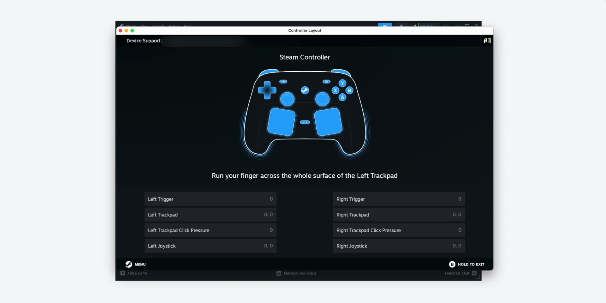

# CrossPuck

[](LICENSE)
[](https://github.com/scryner/crosspuck/releases/latest)



CrossPuck lets Steam running in a CrossOver bottle use a Steam Controller
connected to the macOS host.

_If CrossPuck helps you, a GitHub star would be appreciated._ ⭐

The project is split into two production pieces:

- `crosspuck-app`: a macOS menu bar host app. It reads the physical Steam
  Controller/Puck HID devices, forwards input reports to the guest, and applies
  guest feedback such as rumbles/haptics back to the controller.
- `crosspuck-driver`: a guest-side `hid.dll` for the CrossOver Steam process.
  It exposes virtual HID profiles to Steam and bridges input/output traffic to
  the macOS host app.

Shared HID identity, transport, protocol, and guest runtime logic live in
`crosspuck-core`. `crosspuck-cli` contains development and diagnostic tools.

## Binary DMG Install

Use these instructions when you have a released `.dmg` installer. Rust and the
source tree are not required.

### Requirements

- macOS.
- A CrossOver or CrossOver Preview Steam bottle.
- Steam Puck/Controller visible to the macOS host.
- Steam Puck/Controller paired with a native app on macOS or Windows.
- A CrossPuck `.dmg` release.

### Install CrossPuck

1. Open the `.dmg`, then drag `CrossPuck.app` into `Applications`.
2. Start `CrossPuck.app` once from `Applications`.
3. Open Apple menu > `System Settings` > `Privacy & Security` >
   `Input Monitoring`.
4. Confirm that `CrossPuck.app` is listed and enabled. If it is missing, click
   the add button (`+`), choose `/Applications/CrossPuck.app`, then enable it.
   If an older CrossPuck entry points to a different location, remove that entry
   and add the app from `Applications` again.
5. Quit and restart CrossPuck after changing `Input Monitoring`.
6. Quit Steam in the CrossOver bottle if it is already running.
7. Use the CrossPuck menu bar "Install Steam Driver..." item. This installs
   `hid.dll` next to `Steam.exe` and imports the Wine loader override registry
   file.
8. Keep CrossPuck running, then start Steam from the CrossOver bottle.

The installer handles both `/Applications/CrossOver.app` and
`/Applications/CrossOver Preview.app`. Preview-marked bottles import through
CrossOver Preview first; regular bottles import through CrossOver first; the
other app is used as a fallback when only one is installed.

### Bottles In A Non-Default Location

CrossPuck auto-detects the Steam bottle under
`~/Library/Application Support/CrossOver/Bottles` by default. If your bottle
lives elsewhere (for example on an external drive), or several bottles have
Steam installed, use the menu bar `Advanced` > `Bottle Path` >
`Choose Bottle...` item to pick the CrossOver bottle CrossPuck should use. The
choice is remembered across launches; the `Bottle:` line shows the bottle
currently in use, and `Reset to Default` returns to auto-detection. Two
environment variables override this for scripting: `CROSSPUCK_BOTTLE_PATH`
selects a specific bottle and takes precedence over the menu selection, and
`CROSSPUCK_BOTTLES_DIR` changes the directory that auto-detection scans.

### Verify Wine DLL Override

If Steam does not see the controller, verify the Wine DLL override manually:

1. Open the CrossOver app that owns the Steam bottle. If both CrossOver and
   CrossOver Preview are installed and you are unsure which owns the bottle,
   check the Steam bottle in both apps.
2. Select the Steam bottle.
3. Open `Wine Configuration`.
4. Open the `Libraries` tab.
5. In `Existing overrides`, confirm that `hid (native, builtin)` is present.
6. If it is missing, enter `hid` in `New override for library`, click `Add`,
   select the new `hid` entry, click `Edit...`, choose `Native then Builtin`,
   then click `OK`. Do not remove or replace other existing DLL overrides.
7. Click `Apply`, then `OK`.

## Source Build

Use these instructions when building CrossPuck from this repository.

### Requirements

- macOS with Rust installed.
- A checkout of this repository.
- A CrossOver or CrossOver Preview Steam bottle.
- Steam Puck/Controller visible to the macOS host.
- Steam Puck/Controller paired with a native app on macOS or Windows.

Install the Windows Rust target for the guest DLL:

```sh
rustup target add x86_64-pc-windows-gnu
```

### Build The Host App

Build a debug app bundle. The bundle includes the release guest `hid.dll` under
`Contents/Resources/GuestDriver/`:

```sh
tools/build-app.sh debug
```

Build a release app bundle:

```sh
tools/build-app.sh release
```

The script prints the generated bundle path, for example:

```text
target/release/CrossPuck.app
```

The embedded guest driver manifest is written to:

```text
CrossPuck.app/Contents/Resources/GuestDriver/manifest.json
```

License files are embedded in:

```text
CrossPuck.app/Contents/Resources/LICENSE
CrossPuck.app/Contents/Resources/THIRD-PARTY-NOTICES.md
```

### Build A DMG

Create a drag-and-drop installer DMG from the release app bundle:

```sh
tools/build-dmg.sh
```

The default output is:

```text
target/dmg/CrossPuck-0.1.0.dmg
```

The DMG opens in a conventional drag-and-drop Finder layout: a large
`CrossPuck.app` icon on the left, an arrow in the middle, and an `Applications`
symlink on the right. The mounted DMG volume uses the app's `CrossPuck.icns`
icon. For CI release automation, build and codesign the app first, then package
that signed app:

```sh
tools/build-dmg.sh --app target/release/CrossPuck.app
```

The script does not notarize. GitHub Actions can notarize and staple the signed
app before packaging, or notarize and staple the generated DMG after packaging.

### Run The Built App And Install Driver

Start the app before launching Steam in the CrossOver bottle. On macOS, grant
CrossPuck Input Monitoring permission when prompted; without it the app can
listen for guest connections but cannot open the Steam Controller HID device.
If permission was denied earlier, enable it in `System Settings` >
`Privacy & Security` > `Input Monitoring`, then restart CrossPuck.

Use the menu bar "Install Steam Driver..." item to deploy the embedded
`hid.dll` next to `Steam.exe` in the Steam bottle. Install, update, and repair
also write `crosspuck-wine-override.reg` into the bottle and import it with
CrossOver `regedit`, setting Wine's `hid=native,builtin` DLL override without
rewriting `user.reg` directly. The app supports both `/Applications/CrossOver.app`
and `/Applications/CrossOver Preview.app`: preview-marked bottles import through
CrossOver Preview first, regular bottles import through CrossOver first, and the
other app is used as a fallback when only one is installed. Uninstalling removes
only the app-local `hid.dll`; it intentionally leaves Wine registry settings
unchanged.

### Build The Guest Driver

Build the production guest `hid.dll`:

```sh
cargo build -p crosspuck-driver --release --target x86_64-pc-windows-gnu
```

The output is:

```text
target/x86_64-pc-windows-gnu/release/hid.dll
```

### Manual Shell Install

The menu bar app is the preferred installer. It handles driver
install/update/uninstall automatically, and install/update/repair import the
Wine loader override registry file as described above. The shell installer
below is mainly for manual development and smoke testing.

Copy the driver next to `Steam.exe` in the target bottle:

```sh
tools/install-driver.sh --bottle Steam
```

To also import Wine's `hid=native,builtin` loader override:

```sh
tools/install-driver.sh --bottle Steam --override-dll
```

Useful options:

```sh
tools/install-driver.sh \
  --bottle Steam \
  --driver target/x86_64-pc-windows-gnu/release/hid.dll \
  --no-build
```

The script copies `hid.dll`, backs up any existing local `hid.dll`, and
initializes `crosspuck-driver.log`. By default it does not call CrossOver
`regedit`. With `--override-dll`, it writes `crosspuck-wine-override.reg` into
the bottle and imports it with the matching CrossOver app, using CrossOver
Preview first for preview-marked bottles and CrossOver first for regular
bottles. It does not set guest runtime options or rewrite `user.reg` directly.

Do not install this DLL into `drive_c/windows/system32`. It is designed to live
next to Steam and forward non-virtual HID calls to the real system HID DLL.

## Tools And Diagnostics

Tooling, logging options, smoke checks, development verification commands, and
the macOS HID reference probe are documented in `tools/README.md`.

## License

Copyright 2026 scryner and CrossPuck contributors.

CrossPuck is licensed under the Apache License, Version 2.0. See
`LICENSE`.

Third-party dependency license notices are listed in
`THIRD-PARTY-NOTICES.md`.
